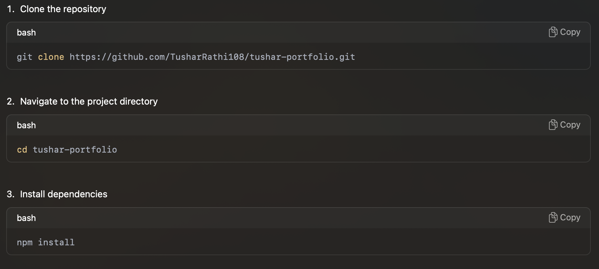
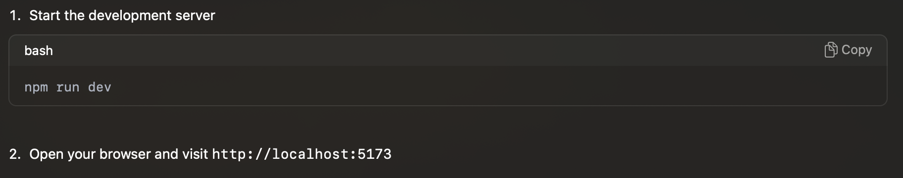
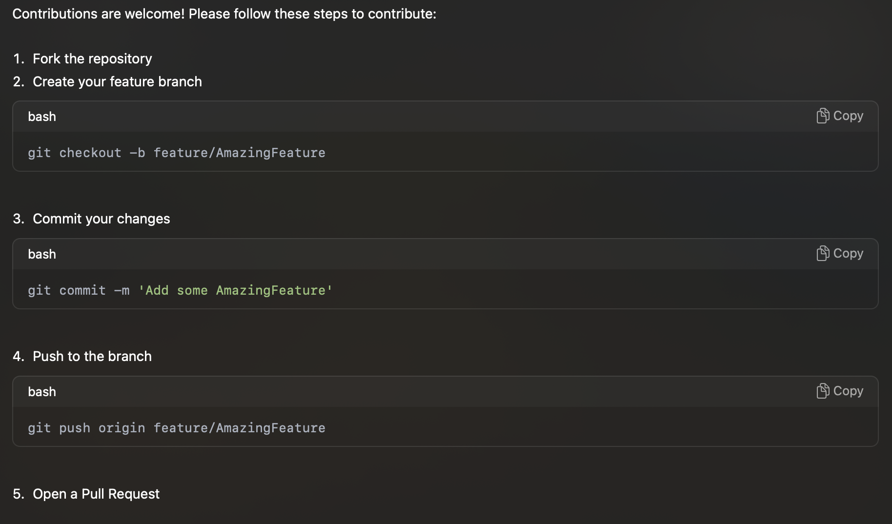

Tushar Rathi Portfolio

Welcome to my portfolio repository! This project showcases my skills and expertise as a Fullstack Developer, featuring a modern and responsive design built with React, Vite, and other cutting-edge technologies. Feel free to explore, use it as a template for your own portfolio, and contribute to make it even better!

Table of Contents

    •	Features
    •	Technologies Used
    •	Getting Started
    •	Usage
    •	Contributing
    •	License
    •	Contact

Features

    •	Responsive Design
    •	Dynamic Routing
    •	SEO Optimization with React Helmet Async
    •	Typewriter Effect for Text Animation
    •	Downloadable Resume Button
    •	Social Media Integration
    •	Interactive Skills Section
    •	Project and Work Showcase

Technologies Used

    •	Frontend: React, Vite, Tailwind CSS, React Router
    •	Icons: React Icons
    •	Animations: react-simple-typewriter
    •	SEO: React Helmet Async
    •	Font: JetBrains Mono

Getting Started

Follow these steps to get a copy of this project up and running on your local machine.

Prerequisites

    •	Node.js
    •	Git

Installation

Running the Project

Usage

This project is designed to be an intuitive and attractive portfolio template. Customize it with your own information, projects, and styles:

    •	Update Profile Information: Modify the HomePage.tsx component to include your name, skills, and a brief introduction.
    •	Add Your Projects: Create new pages or modify existing ones to showcase your projects.
    •	Customize Styles: Adjust the Tailwind CSS classes to match your personal branding.

Contributing

License

This project is licensed under the MIT License - see the LICENSE file for details.

Contact

Feel free to reach out for collaboration, questions, or feedback:

    •	Email: tushar.rathi860@gmail.com
    •	LinkedIn: Tushar Rathi

Thank you for visiting my portfolio repository! I hope you find it useful and inspiring. Happy coding! 🚀
